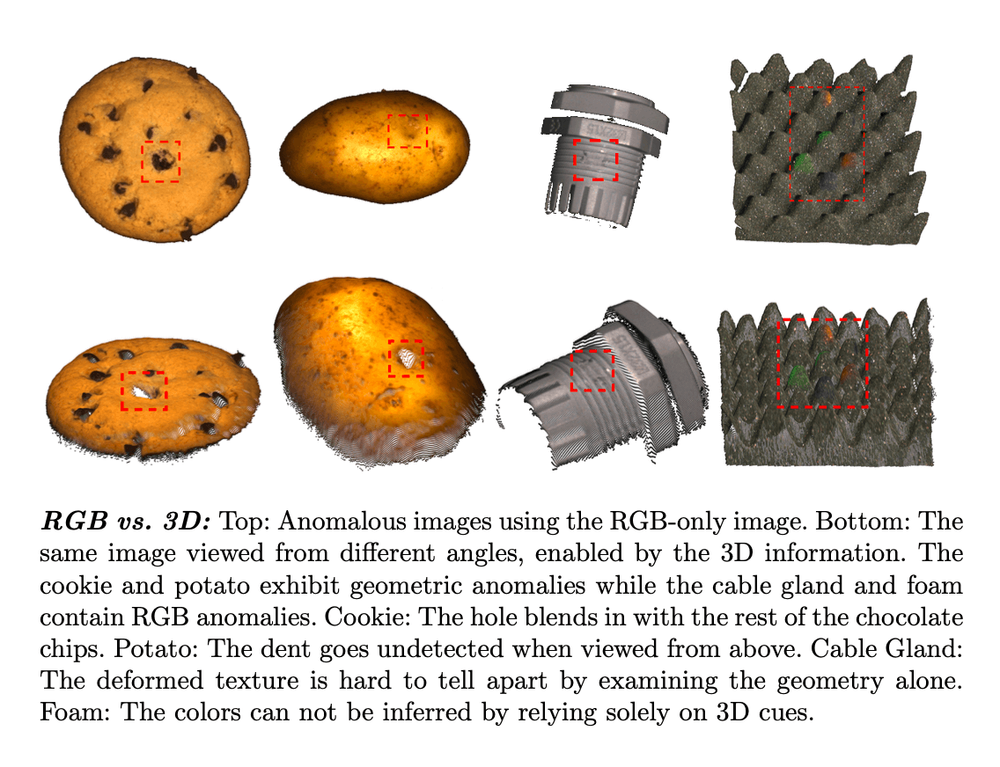

# An Empirical Investigation of 3D Anomaly Detection and Segmentation
### [Project](https://www.vision.huji.ac.il/3d_ads) | [Paper](https://arxiv.org/abs/2203.05550) <br>
Official PyTorch Implementation for the "An Empirical Investigation of 3D Anomaly Detection and Segmentation" paper.  


We conduct an empirical investigation which seeks the answers to several
questions: 
1. Are current 3D methods outperforming state-of-the-art 2D AD&S methods? 
2. Is 3D information potentially useful for AD&S? 
3. What are effective ways of representing 3D local regions for AD&S? 
4. Are there complementary benefits from using both 3D and color features? 

___

> **An Empirical Investigation of 3D Anomaly Detection and Segmentation**<br>
> Eliahu Horwitz, Yedid Hoshen<br>
> https://arxiv.org/abs/2203.05550 <br>
>
>**Abstract:** Anomaly detection and segmentation (AD&S) in images has made tremendous progress in recent years while 3D information has often been ignored. 
> The objective of this paper is to further understand the benefit and role of 3D as apposed to color in image anomaly detection. 
> Our study begins by presenting a surprising finding: standard color-only anomaly segmentation methods, when applied to 3D datasets, significantly outperform all current methods.
> On the other hand, we observe that color-only methods are insufficient for images containing geometric anomalies where shape cannot be unambiguously inferred from 2D. 
> This suggests that better 3D methods are needed. We investigate different representations for 3D anomaly detection 
> and discover that hand-crafted orientation-invariant representations are unreasonably effective on this task. 
> We uncover a simple 3D-only method that outperforms all recent approaches while not using deep learning, external pretraining datasets or color information.
> As the 3D-only method cannot detect color and texture anomalies, we combine it with 2D color features, 
> granting us the best current results by a large margin (pixel ROCAUC: 99.2%, PRO: 95.9% on MVTec 3D-AD). 
> We conclude by discussing future challenges for 3D anomaly detection and segmentation.




## Getting Started

### Setup 
1.  Clone the repo:
```bash
git clone https://github.com/eliahuhorwitz/3D-ADS.git
cd 3D-ADS
```
2. Create a new environment and install the libraries:
```bash
python3.7 -m venv 3d_ads_venv
source 3d_ads_venv/bin/activate
pip install -r requirements.txt
```
3. Download and extract the dataset
```bash
cd datasets
wget https://www.mydrive.ch/shares/45920/dd1eb345346df066c63b5c95676b961b/download/428824485-1643285832/mvtec_3d_anomaly_detection.tar.xz
tar -xvf mvtec_3d_anomaly_detection.tar.xz && mv mvtec_3d_anomaly_detection mvtec3d
```
<br>
<br>


### Training
We provide the implementations for 7 methods investigated in the paper. These are:
- RGB iNet
- Depth iNet
- Raw
- HoG
- SIFT
- FPFH
- RGB + FPFH

To run all methods on all 10 classes and save the PRO, Image ROCAUC, Pixel ROCAUC results to markdown tables run  
```bash
python3 main.py
```

To change which classes are used, see `mvtec3d_classes` located at `data/mvtec3d.py`. <br>
To change which methods are used, see the `PatchCore` constructor located at `patchcore_runner.py` and the `METHOD_NAMES` variable located at `main.py`.

**Note:** the results below are of the raw dataset, see the preprocessing section for the preprocessing code and results (as seen in the paper). 
The pixel wise metrics benefit from the preprocessing.  


#### AU PRO Results

| Method     |   Bagel |   Cable Gland |   Carrot |   Cookie |   Dowel |   Foam |   Peach |   Potato |   Rope |   Tire |   Mean |
|:-----------|--------:|--------------:|---------:|---------:|--------:|-------:|--------:|---------:|-------:|-------:|-------:|
| RGB iNet   |   0.898 |   0.948 |   0.927 |   0.872 |   0.927 |   0.555 |   0.902 |   0.931 |   0.903 |   0.899 |   0.876 |
| Depth iNet |   0.701 |   0.544 |   0.791 |   0.835 |   0.531 |   0.100 |   0.800 |   0.549 |   0.827 |   0.185 |   0.586 |
| Raw        |   0.040 |   0.047 |   0.433 |   0.080 |   0.283 |   0.099 |   0.035 |   0.168 |   0.631 |   0.093 |   0.191 |
| HoG        |   0.518 |   0.609 |   0.857 |   0.342 |   0.667 |   0.340 |   0.476 |   0.893 |   0.700 |   0.739 |   0.614 |
| SIFT       |   0.894 |   0.722 |   0.963 |   0.871 |   0.926 |   0.613 |   0.870 |   0.973 |   0.958 |   0.873 |   0.866 |
| FPFH       |   0.972 |   0.849 |   **0.981** |   0.939 |   0.963 |   0.693 |   0.975 |   **0.981** |   **0.980** |   0.949 |   0.928 |
| RGB + FPFH |   **0.976** |   **0.967** |   0.979 |   **0.974** |   **0.971** |   **0.884** |   **0.976** |   **0.981** |   0.959 |   **0.971** |   **0.964** |


#### Image ROCAUC Results

| Method     |   Bagel |   Cable Gland |   Carrot |   Cookie |   Dowel |   Foam |   Peach |   Potato |   Rope |   Tire |   Mean |
|:-----------|--------:|--------------:|---------:|---------:|--------:|-------:|--------:|---------:|-------:|-------:|-------:|
| RGB iNet   |   0.854 |   **0.840** |   0.824 |   0.687 |   **0.974** |   0.716 |    0.713 |   0.593 |   0.920 |   0.724 |   0.785 |
| Depth iNet |   0.624 |   0.683 |   0.676 |   0.838 |   0.608 |   0.558 |    0.567 |   0.496 |   0.699 |   0.619 |   0.637 |
| Raw        |   0.578 |   0.732 |   0.444 |   0.798 |   0.579 |   0.537 |    0.347 |   0.306 |   0.439 |   0.517 |   0.528 |
| HoG        |   0.560 |   0.615 |   0.676 |   0.491 |   0.598 |   0.489 |    0.542 |   0.553 |   0.655 |   0.423 |   0.560 |
| SIFT       |   0.696 |   0.553 |   0.824 |   0.696 |   0.795 |   **0.773** |    0.573 |   0.746 |   0.936 |   0.553 |   0.714 |
| FPFH       |   0.820 |   0.533 |   0.877 |   0.769 |   0.718 |   0.574 |    0.774 |   0.895 |   **0.990** |   0.582 |   0.753 |
| RGB + FPFH |   **0.938** |   0.765 |   **0.972** |   **0.888** |   0.960 |   0.664 |    **0.904** |   **0.929** |   0.982 |   **0.726** |   **0.873** |
___

#### Pixel ROCAUC Results 

| Method     |   Bagel |   Cable Gland |   Carrot |   Cookie |   Dowel |   Foam |   Peach |   Potato |   Rope |   Tire |   Mean |
|:-----------|--------:|--------------:|---------:|---------:|--------:|-------:|--------:|---------:|-------:|-------:|-------:|
| RGB iNet   |   0.983 |   0.984 |   0.980 |   0.974 |   0.985 |   0.836 |   0.976 |   0.982 |   0.989 |   0.975 |   0.966 |
| Depth iNet |   0.941 |   0.759 |   0.933 |   0.946 |   0.829 |   0.518 |   0.939 |   0.743 |   0.974 |   0.632 |   0.821 |
| Raw        |   0.404 |   0.306 |   0.772 |   0.457 |   0.641 |   0.478 |   0.354 |   0.602 |   0.905 |   0.558 |   0.548 |
| HoG        |   0.782 |   0.846 |   0.965 |   0.684 |   0.848 |   0.741 |   0.779 |   0.973 |   0.926 |   0.903 |   0.845 |
| SIFT       |   0.974 |   0.862 |   0.993 |   0.952 |   0.980 |   0.862 |   0.955 |   0.996 |   0.993 |   0.971 |   0.954 |
| FPFH       |   0.995 |   0.955 |   **0.998** |   0.971 |   0.993 |   0.911 |   0.995 |   **0.999** |   **0.998** |   0.988 |   0.980 |
| RGB + FPFH |   **0.996** |   **0.991** |   0.997 |   **0.995** |   **0.995** |   **0.972** |   **0.996** |   0.998 |   0.995 |   **0.994** |   **0.993** |
___


### Preprocessing
As mentioned in the paper, the results reported use the preprocessed dataset. <br>
While this preprocessing helps in cases where depth images are used, when using the point cloud the results are less pronounced. <br>
The preprocessing script is provided, however, it may take a few hours to run. Results for the preprocessed dataset are reported below. <br>

To run the preprocessing 
```bash
python3 utils/preprocessing.py datasets/mvtec3d/
```

**Note:** the preprocessing is performed inplace (i.e. overriding the original dataset)

#### Preprocessed AU PRO Results 

| Method     |   Bagel |   Cable Gland |   Carrot |   Cookie |   Dowel |   Foam |   Peach |   Potato |   Rope |   Tire |   Mean |
|:-----------|--------:|--------------:|---------:|---------:|--------:|-------:|--------:|---------:|-------:|-------:|-------:|
| RGB iNet   |   0.902 |   0.948 |   0.929 |   0.873 |   0.891 |   0.570 |   0.903 |   0.933 |  0.909 |  0.905 |  0.876 |
| Depth iNet |   0.763 |   0.676 |   0.884 |   0.883 |   0.864 |   0.322 |   0.881 |   0.840 |  0.844 |  0.634 |  0.759 |
| Raw        |   0.402 |   0.314 |   0.639 |   0.498 |   0.251 |   0.259 |   0.527 |   0.531 |  0.808 |  0.215 |  0.444 |
| HoG        |   0.712 |   0.761 |   0.932 |   0.487 |   0.833 |   0.520 |   0.743 |   0.949 |  0.916 |  0.858 |  0.771 |
| SIFT       |   0.944 |   0.845 |   0.975 |   0.894 |   0.909 |   0.733 |   0.946 |   0.981 |  0.953 |  0.928 |  0.911 |
| FPFH       |   0.974 |   0.878 |   **0.982** |   0.908 |   0.892 |   0.730 |   **0.977** |   **0.982** |  **0.956** |  0.962 |  0.924 |
| RGB + FPFH |   **0.976** |   **0.968** |   0.979 |   **0.972** |   **0.932** |   **0.884** |   0.975 |   0.981 |  0.950 |  **0.972** |  **0.959** |
___

#### Preprocessed Image ROCAUC Results 

| Method     |   Bagel |   Cable Gland |   Carrot |   Cookie |   Dowel |   Foam |   Peach |   Potato |   Rope |   Tire |   Mean |
|:-----------|--------:|--------------:|---------:|---------:|--------:|-------:|--------:|---------:|-------:|-------:|-------:|
| RGB iNet   |   0.875 |   **0.880** |   0.777 |   0.705 |   **0.938** |   **0.720** |   0.718 |   0.615 |  0.859 |  0.681 |  0.777 |
| Depth iNet |   0.690 |   0.597 |   0.753 |   0.862 |   0.881 |   0.590 |   0.597 |   0.598 |  0.791 |  0.577 |  0.694 |
| Raw        |   0.627 |   0.507 |   0.600 |   0.654 |   0.573 |   0.524 |   0.532 |   0.612 |  0.412 |  0.678 |  0.572 |
| HoG        |   0.487 |   0.587 |   0.691 |   0.545 |   0.643 |   0.596 |   0.516 |   0.584 |  0.507 |  0.430 |  0.559 |
| SIFT       |   0.722 |   0.640 |   0.892 |   0.762 |   0.829 |   0.678 |   0.623 |   0.754 |  0.767 |  0.603 |  0.727 |
| FPFH       |   0.825 |   0.534 |   0.952 |   0.783 |   0.883 |   0.581 |   0.758 |   0.889 |  **0.929** |  0.656 |  0.779 |
| RGB + FPFH |   **0.923** |   0.770 |   **0.967** |   **0.905** |   0.928 |   0.657 |   **0.913** |   **0.915** |  0.921 |  **0.881** |  **0.878** |

___

#### Preprocessed Pixel ROCAUC Results

| Method     |   Bagel |   Cable Gland |   Carrot |   Cookie |   Dowel |   Foam |   Peach |   Potato |   Rope |   Tire |   Mean |
|:-----------|--------:|--------------:|---------:|---------:|--------:|-------:|--------:|---------:|-------:|-------:|-------:|
| RGB iNet   |   0.983 |   0.984 |   0.98  |   0.974 |   0.973 |  0.851 |   0.976 |   0.983 |  0.987 |  0.977 |  0.967 |
| Depth iNet |   0.957 |   0.901 |   0.966 |   0.970 |   0.967 |  0.771 |   0.971 |   0.949 |  0.977 |  0.891 |  0.932 |
| Raw        |   0.803 |   0.750 |   0.849 |   0.801 |   0.610 |  0.696 |   0.830 |   0.772 |  0.951 |  0.670 |  0.773 |
| HoG        |   0.911 |   0.933 |   0.985 |   0.823 |   0.936 |  0.862 |   0.923 |   0.987 |  0.980 |  0.955 |  0.930 |
| SIFT       |   0.986 |   0.957 |   0.996 |   0.952 |   0.967 |  0.921 |   0.986 |   0.998 |  0.994 |  0.983 |  0.974 |
| FPFH       |   0.995 |   0.965 |   **0.999** |   0.947 |   0.966 |  0.928 |   **0.996** |   **0.999** |  **0.996** |  0.991 |  0.978 |
| RGB + FPFH |   **0.996** |   **0.992** |   0.997 |   **0.994** |   **0.981** |  **0.973** |   **0.996** |   0.998 |  0.994 |  **0.995** |  **0.992** |


## Citation
If you find this repository useful for your research, please use the following.

```
@misc{2203.05550,
Author = {Eliahu Horwitz and Yedid Hoshen},
Title = {An Empirical Investigation of 3D Anomaly Detection and Segmentation},
Year = {2022},
Eprint = {arXiv:2203.05550},
```


## Acknowledgments
- This work was supported in part by Oracle Cloud credits and related resources provided by the Oracle for Research program. [https://www.oracle.com/research](https://www.oracle.com/research)
 - The SIFT implementation is based on [Kornia](https://github.com/kornia/kornia)
 - The PatchCore logic is based on [https://github.com/rvorias/ind_knn_ad](https://github.com/rvorias/ind_knn_ad)